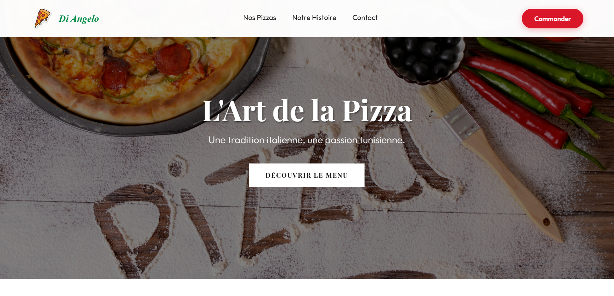

# 🍕 Pizza Restaurant - One Page Website

<div align="center">

[](https://medgaz.github.io/restaurant/)

</div>

Un site web one-page élégant et responsive pour un restaurant de pizzas, développé exclusivement en HTML5 et CSS3 pur, sans framework ni bibliothèque JavaScript.

## 📸 Aperçu

<div align="center">
  <a href="https://medgaz.github.io/restaurant/" target="_blank">
    
  </a>
</div>

## 🌐 Démo en Ligne

**👉 [Voir le site en direct](https://medgaz.github.io/restaurant/)**

Un site web one-page élégant et responsive pour un restaurant de pizzas, développé exclusivement en HTML5 et CSS3 pur, sans framework ni bibliothèque JavaScript.

## 🌐 Démo en Ligne

**[👉 Voir la démo](https://medgaz.github.io/restaurant/)**

## 📋 Description

Ce projet présente un site vitrine moderne pour un restaurant de pizzas, conçu avec une approche minimaliste utilisant uniquement les technologies web natives. L'interface offre une expérience utilisateur fluide et intuitive sur tous les appareils.

## ✨ Fonctionnalités

- **Design Responsive** : Adaptation parfaite aux écrans mobiles, tablettes et desktop
- **Navigation fluide** : Menu de navigation avec ancres vers les différentes sections
- **Sections principales** :
  - Hero/Bannière d'accueil accrocheuse
  - Menu des pizzas avec descriptions et prix
  - Section À propos du restaurant (Notre Histoire)
  - Coordonnées et Horaires
  - Footer avec informations pratiques

## 🛠️ Technologies Utilisées

- **HTML5** : Structure sémantique et accessible
- **CSS3** : Styling moderne avec Flexbox/Grid, animations et transitions

## 🚀 Installation et Utilisation

1. Clonez le repository :
```bash
git clone https://github.com/meDGaz/restaurant.git
```

2. Ouvrez le fichier `index.html` dans votre navigateur préféré

Aucune installation de dépendances nécessaire ! 

## 📱 Compatibilité

- Chrome (dernière version)
- Firefox (dernière version)
- Safari (dernière version)
- Edge (dernière version)


## 👤 Auteur

Mohamed Gazzoun - [@meDGaz](https://github.com/meDGaz)

---

⭐ N'hésitez pas à mettre une étoile si ce projet vous plaît !
